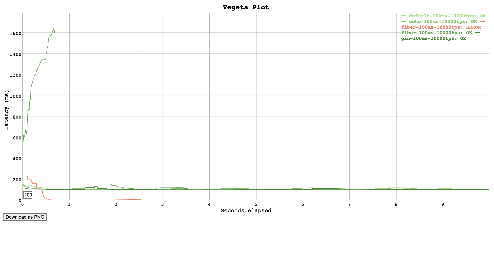

# Go web http2 benchmark

Go web htt2 benchmark suite.

# Frameworks

| Name                       | License           | Version          |
| ---------------------------| ----------------- | ---------------- |
| [echo]                     | MIT               | 4.1.17           |
| [gin]                      | MIT               | 1.6.3            |
| [fiber]                    | MIT               | 2.0.2            |

[echo]: https://github.com/labstack/echo
[gin]: https://github.com/gin-gonic/gin
[fiber]: https://github.com/gofiber/fiber


## Prerequisites

```sh
$ brew install vegeta mkcert
$ mkcert -install
$ mkcert localhost 127.0.0.1 ::1
```

## Test

Setting mock 100ms processing time and request 10000 req/s.

[](report/plot-100ms-10000tps.png)
